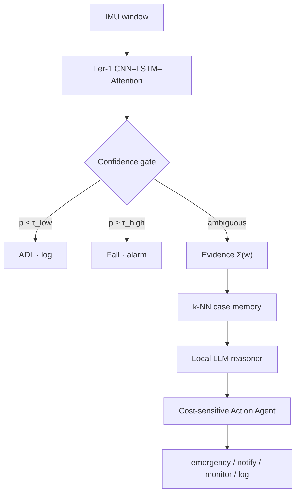

# Agentic Elder Fall Detection

A confidence-gated multi-agent wrapper around a fixed CNN–LSTM–Attention fall detector. Clear windows are decided on-device. Ambiguous windows escalate to retrieval-augmented local LLM reasoning and a cost-sensitive action.

Primary results, subject-independent 5-fold:

| Protocol | Tier-1 F1 | Full stack | Note |
|---|---:|---:|---|
| SisFall ambiguous bench (D18/D19) | 0.713 | **0.896** | ΔF1 +0.183 |
| SisFall main (n=1000) | 0.759±0.014 | **0.887±0.029** | cost/1000 1151→200 |
| KFall binary transfer | 0.987 | 0.990 | stability, not a headline gain |

## Architecture



System 1 is the detector and gate. System 2 runs only on the ambiguous band.

## Layout

| Path | Role |
|---|---|
| `src/agentic_fall/` | Models, gate, retrieval, LLM, action |
| `configs/` | Locked paper protocol |
| `scripts/` | Train, evaluate, tables |
| `results/` | Summary JSON behind the tables |

## Run

```bash
pip install -r requirements.txt
python scripts/train_tier1.py --fold 0
python scripts/run_ablations.py --fold 0
```

SisFall and KFall raw data are not in this repository. Place processed windows locally before training. Checkpoints and case-memory files are also local only.
